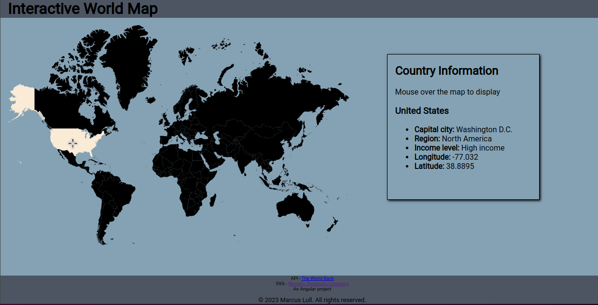

# Interactive World Map
An Angular project  
(Angular Core: 16.1.0)

***

## Screenshot

## Description
The interactive worldmap displays data on mouse-over in real time to the info component.
The information data is retrieved via API call to an external server (https://datahelpdesk.worldbank.org/) where it is stored in a cache and retrieved from there.
The application uses 3 components with the info and map components being siblings. Mouse-over even data is emitted up to the parent component and back down to the
info component where the API call is made and data cached and displayed.

## Installation
1. Clone the project
2. Install Node.js, NPM and Angular CLI
3. Run `npm install`
4. Run `ng serve` for a dev server. Navigate to `http://localhost:4200/`

